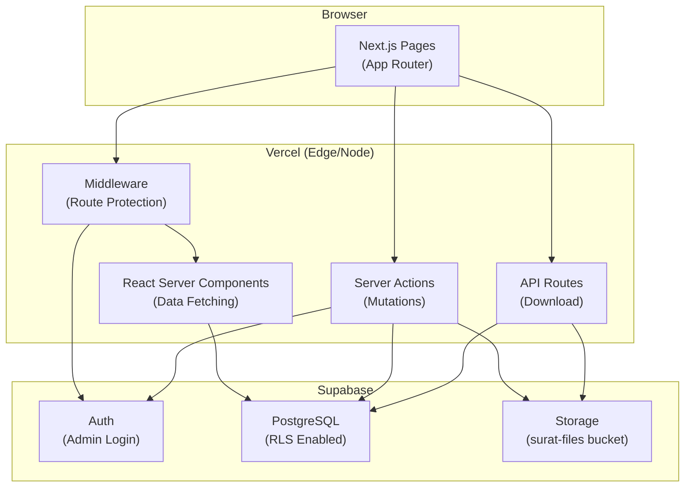
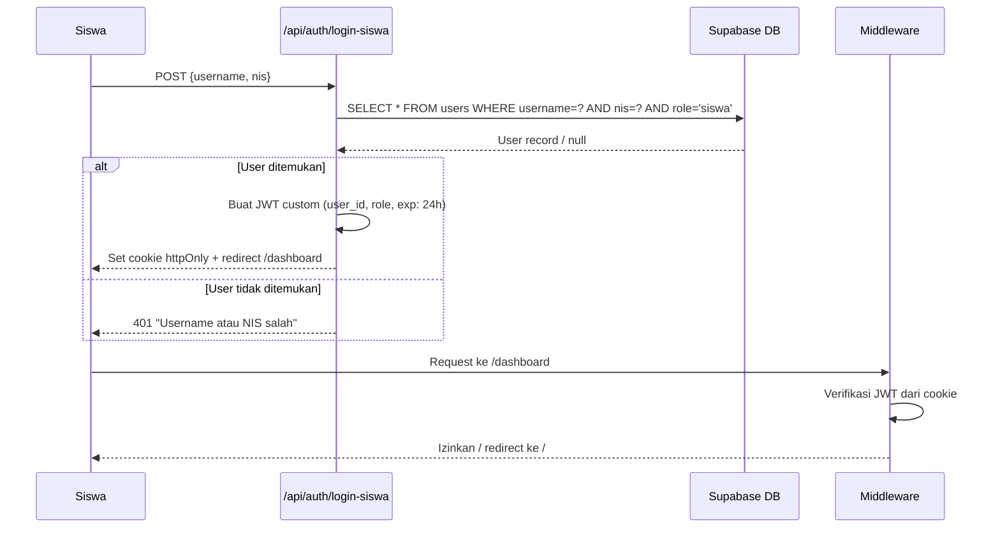
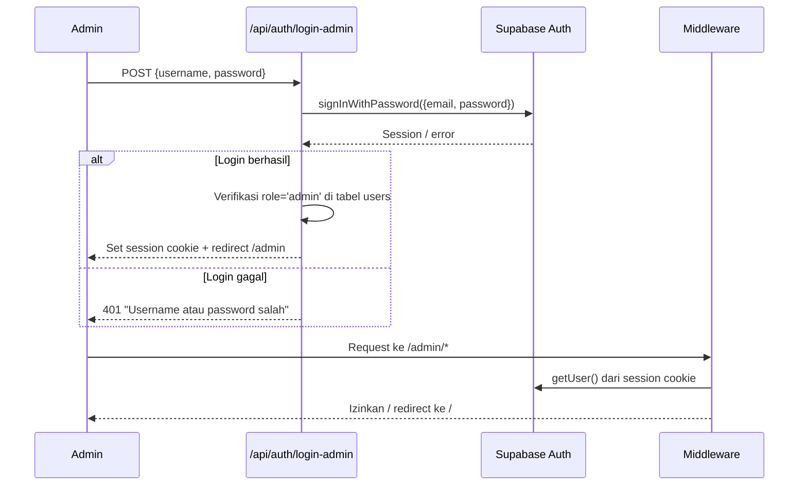
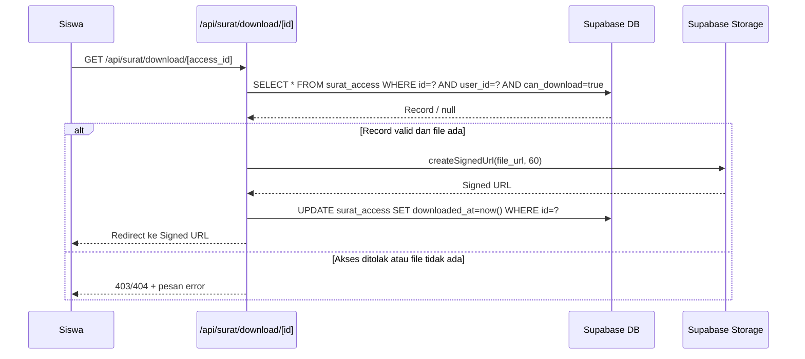
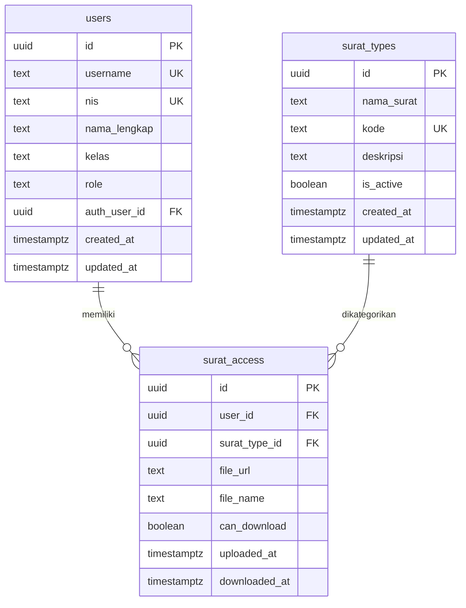

# Dokumen Desain Teknis — Portal Surat

## Ikhtisar

Portal Surat adalah aplikasi web yang memungkinkan Admin SMA mengelola distribusi surat digital kepada siswa. Admin dapat mendaftarkan siswa sebagai penerima surat, mengunggah file PDF, dan mengontrol hak akses unduhan. Siswa dapat login dan mengunduh surat yang telah disiapkan.

Sistem dibangun di atas **Next.js 14 (App Router)** sebagai framework frontend dan backend, **Supabase** sebagai platform backend (Auth, PostgreSQL, Storage), **Tailwind CSS** untuk styling, dan di-deploy ke **Vercel**.

### Keputusan Desain Utama

| Keputusan | Pilihan | Alasan |
|-----------|---------|--------|
| Autentikasi siswa | Custom RPC + session cookie | Siswa tidak memiliki email/password; autentikasi via username+NIS |
| Autentikasi admin | Supabase Auth `signInWithPassword` | Admin memiliki kredensial standar; memanfaatkan fitur Auth bawaan |
| Penyimpanan file | Supabase Storage (private bucket) | Integrasi native dengan RLS; signed URL untuk akses aman |
| State management | React Server Components + Server Actions | Meminimalkan client-side JS; memanfaatkan App Router |
| Akses data | Supabase client dengan RLS | Keamanan berlapis di level database |

---

## Arsitektur

### Gambaran Umum



### Alur Autentikasi

**Siswa (Custom Flow):**


**Admin (Supabase Auth):**


### Alur Unduhan Surat



---

## Komponen dan Antarmuka

### Struktur Folder

```
src/
├── app/
│   ├── page.tsx                          # Landing + Login (public)
│   ├── dashboard/
│   │   └── page.tsx                      # Dashboard Siswa (protected)
│   ├── admin/
│   │   └── page.tsx                      # Dashboard Admin (protected)
│   └── api/
│       ├── auth/
│       │   ├── login-siswa/route.ts      # POST: autentikasi siswa
│       │   ├── login-admin/route.ts      # POST: autentikasi admin
│       │   └── logout/route.ts           # POST: hapus sesi
│       └── surat/
│           └── download/[id]/route.ts    # GET: generate signed URL + catat download
├── components/
│   ├── ui/
│   │   ├── Modal.tsx
│   │   ├── ConfirmDialog.tsx
│   │   ├── Badge.tsx
│   │   └── Toggle.tsx
│   ├── auth/
│   │   └── LoginForm.tsx                 # Tab toggle siswa/admin
│   ├── siswa/
│   │   ├── SuratCard.tsx
│   │   └── SuratGrid.tsx
│   └── admin/
│       ├── AdminTabs.tsx
│       ├── SiswaTable.tsx
│       ├── SuratTypeList.tsx
│       ├── SuratAccessTable.tsx
│       └── UploadSuratModal.tsx
├── lib/
│   ├── supabase/
│   │   ├── client.ts                     # Browser Supabase client
│   │   ├── server.ts                     # Server Supabase client (cookies)
│   │   └── admin.ts                      # Service role client (server-only)
│   ├── auth/
│   │   ├── session.ts                    # JWT helpers untuk sesi siswa
│   │   └── middleware-helpers.ts
│   └── validations/
│       ├── auth.ts                       # Zod schemas untuk login
│       ├── siswa.ts                      # Zod schemas untuk CRUD siswa
│       ├── surat-type.ts                 # Zod schemas untuk jenis surat
│       └── surat-access.ts              # Zod schemas untuk akses surat
├── actions/
│   ├── siswa.ts                          # Server Actions: CRUD siswa
│   ├── surat-types.ts                    # Server Actions: CRUD jenis surat
│   └── surat-access.ts                  # Server Actions: kelola akses surat
└── middleware.ts                         # Route protection
```

### Antarmuka Komponen Utama

#### `LoginForm`
```typescript
interface LoginFormProps {
  defaultTab?: 'siswa' | 'admin'
}
// State: activeTab, isLoading, error
// Merender dua form berbeda berdasarkan tab aktif
```

#### `SuratCard`
```typescript
interface SuratCardProps {
  suratType: {
    id: string
    nama_surat: string
    kode: string
    deskripsi: string | null
  }
  access: {
    id: string
    can_download: boolean
    file_url: string | null
    downloaded_at: string | null
  } | null
}
// Menampilkan tombol "Unduh PDF" atau "Belum tersedia" berdasarkan access
```

#### `SiswaTable`
```typescript
interface SiswaTableProps {
  initialData: Siswa[]
  totalCount: number
}
// Client component dengan state: search, page, modalOpen, selectedSiswa
```

#### `SuratAccessTable`
```typescript
interface SuratAccessTableProps {
  initialData: SuratAccessRow[]
  suratTypes: SuratType[]
}
// Client component dengan state: filterJenis, modalOpen, selectedAccess
```

### Server Actions

Semua mutasi data menggunakan Next.js Server Actions untuk keamanan dan kesederhanaan:

```typescript
// actions/siswa.ts
export async function createSiswa(data: CreateSiswaInput): Promise<ActionResult>
export async function updateSiswa(id: string, data: UpdateSiswaInput): Promise<ActionResult>
export async function deleteSiswa(id: string): Promise<ActionResult>

// actions/surat-types.ts
export async function createSuratType(data: CreateSuratTypeInput): Promise<ActionResult>
export async function toggleSuratTypeStatus(id: string): Promise<ActionResult>
export async function deleteSuratType(id: string): Promise<ActionResult>

// actions/surat-access.ts
export async function createSuratAccess(data: CreateSuratAccessInput): Promise<ActionResult>
export async function uploadSuratFile(accessId: string, file: File): Promise<ActionResult>
export async function toggleCanDownload(accessId: string): Promise<ActionResult>
export async function deleteSuratAccess(accessId: string): Promise<ActionResult>

type ActionResult = { success: true; data?: unknown } | { success: false; error: string }
```

---

## Model Data

### Skema Database (dari `001_initial_schema.sql`)



### Catatan Penting Model Data

- `surat_access.file_url` dan `file_name` bersifat **opsional (NULL)** — rekaman dapat dibuat sebelum file tersedia (Tahap 1: daftarkan penerima).
- `surat_access.can_download` default `true` saat rekaman dibuat, dapat diubah admin kapan saja secara independen dari keberadaan file.
- `users.auth_user_id` hanya diisi untuk admin (link ke Supabase Auth). Siswa tidak memiliki akun Supabase Auth.
- Constraint `UNIQUE(user_id, surat_type_id)` memastikan satu siswa hanya memiliki satu rekaman per jenis surat.
- `surat_types.kode` memiliki constraint `CHECK (kode = UPPER(kode))` di level database.

### Tipe TypeScript

```typescript
// types/database.ts
export interface User {
  id: string
  username: string
  nis: string | null
  nama_lengkap: string
  kelas: string | null
  role: 'siswa' | 'admin'
  auth_user_id: string | null
  created_at: string
  updated_at: string
}

export interface SuratType {
  id: string
  nama_surat: string
  kode: string
  deskripsi: string | null
  is_active: boolean
  created_at: string
  updated_at: string
}

export interface SuratAccess {
  id: string
  user_id: string
  surat_type_id: string
  file_url: string | null
  file_name: string | null
  can_download: boolean
  uploaded_at: string
  downloaded_at: string | null
}

// Tipe sesi untuk siswa (disimpan di JWT custom)
export interface SiswaSession {
  user_id: string
  username: string
  nama_lengkap: string
  nis: string
  kelas: string
  role: 'siswa'
  exp: number
}
```

### Skema Validasi (Zod)

```typescript
// lib/validations/auth.ts
export const loginSiswaSchema = z.object({
  username: z.string().min(1, 'Username wajib diisi'),
  nis: z.string().min(1, 'NIS wajib diisi'),
})

export const loginAdminSchema = z.object({
  username: z.string().min(1, 'Username wajib diisi'),
  password: z.string().min(8, 'Password minimal 8 karakter'),
})

// lib/validations/siswa.ts
export const createSiswaSchema = z.object({
  nama_lengkap: z.string().min(1, 'Nama lengkap wajib diisi'),
  username: z.string().min(1, 'Username wajib diisi'),
  nis: z.string().min(1, 'NIS wajib diisi'),
  kelas: z.string().min(1, 'Kelas wajib diisi'),
})

// lib/validations/surat-type.ts
export const createSuratTypeSchema = z.object({
  nama_surat: z.string().min(1, 'Nama surat wajib diisi'),
  kode: z.string().min(1, 'Kode wajib diisi').regex(/^[A-Z]+$/, 'Kode harus huruf kapital semua'),
  deskripsi: z.string().optional(),
})

// lib/validations/surat-access.ts
export const createSuratAccessSchema = z.object({
  user_id: z.string().uuid('Siswa wajib dipilih'),
  surat_type_id: z.string().uuid('Jenis surat wajib dipilih'),
})

export const uploadFileSchema = z.object({
  file: z
    .instanceof(File)
    .refine((f) => f.type === 'application/pdf', 'File harus berformat PDF')
    .refine((f) => f.size <= 10 * 1024 * 1024, 'Ukuran file maksimal 10 MB'),
})
```

---

## Properti Kebenaran

*Properti adalah karakteristik atau perilaku yang harus berlaku pada semua eksekusi sistem yang valid — pada dasarnya, pernyataan formal tentang apa yang seharusnya dilakukan sistem. Properti berfungsi sebagai jembatan antara spesifikasi yang dapat dibaca manusia dan jaminan kebenaran yang dapat diverifikasi secara otomatis.*

### Properti 1: Validasi Input Login Menolak Field Kosong/Whitespace

*Untuk setiap* kombinasi (username, nis) di mana salah satu atau keduanya adalah string kosong atau hanya terdiri dari whitespace, fungsi validasi login siswa harus mengembalikan error validasi dan menolak proses autentikasi.

**Memvalidasi: Persyaratan 1.3**

---

### Properti 2: Autentikasi Siswa Gagal untuk Kredensial Tidak Valid

*Untuk setiap* pasangan (username, nis) yang tidak cocok dengan data manapun di tabel `users`, Autentikator harus mengembalikan pesan error yang tidak mengungkap field mana yang salah, dan tidak membuat sesi.

**Memvalidasi: Persyaratan 1.5**

---

### Properti 3: Validasi Password Admin Menolak Password Pendek

*Untuk setiap* string password dengan panjang kurang dari 8 karakter, fungsi validasi login admin harus mengembalikan error validasi. Untuk setiap string dengan panjang 8 karakter atau lebih, validasi panjang harus lolos.

**Memvalidasi: Persyaratan 2.3**

---

### Properti 4: Header Dashboard Siswa Selalu Menampilkan Data Lengkap

*Untuk setiap* data user siswa yang valid (dengan nama_lengkap, kelas, dan nis yang tidak kosong), komponen header dashboard harus merender ketiga informasi tersebut dalam output HTML-nya.

**Memvalidasi: Persyaratan 3.1**

---

### Properti 5: Grid Surat Hanya Menampilkan Jenis Surat Aktif

*Untuk setiap* daftar `surat_types` dengan campuran status aktif dan nonaktif, jumlah kartu yang dirender di dashboard siswa harus sama persis dengan jumlah surat_type yang memiliki `is_active = true`.

**Memvalidasi: Persyaratan 3.2, 5.7**

---

### Properti 6: Status Tombol Kartu Surat Sesuai Kondisi Akses

*Untuk setiap* kombinasi (surat_type, surat_access), tombol yang ditampilkan pada kartu surat harus mengikuti aturan: jika `surat_access` ada dan `can_download = true` maka tombol "Unduh PDF" aktif; dalam semua kondisi lain (tidak ada akses, atau `can_download = false`) maka tombol "Belum tersedia" disabled ditampilkan.

**Memvalidasi: Persyaratan 3.4, 3.5**

---

### Properti 7: Pencatatan Timestamp Download

*Untuk setiap* rekaman `surat_access` yang valid dengan `can_download = true` dan `file_url` tidak NULL, setelah fungsi download berhasil dipanggil, kolom `downloaded_at` pada rekaman tersebut harus bernilai non-NULL dan mencerminkan waktu eksekusi.

**Memvalidasi: Persyaratan 3.7**

---

### Properti 8: Paginasi Tidak Melebihi Batas Per Halaman

*Untuk setiap* daftar siswa dengan N item, halaman manapun dalam hasil paginasi tidak boleh menampilkan lebih dari 20 baris siswa.

**Memvalidasi: Persyaratan 4.2**

---

### Properti 9: Pencarian Siswa Bersifat Case-Insensitive dan Konsisten

*Untuk setiap* query pencarian dan daftar siswa, semua hasil yang dikembalikan harus mengandung string query di kolom `nama_lengkap` atau `nis` (case-insensitive), dan tidak ada siswa yang mengandung query tersebut yang boleh absen dari hasil.

**Memvalidasi: Persyaratan 4.3**

---

### Properti 10: Validasi Form Siswa Menolak Field Kosong

*Untuk setiap* kombinasi input form siswa (nama_lengkap, username, nis, kelas) di mana salah satu field kosong atau hanya whitespace, fungsi validasi harus mengembalikan error dan menolak operasi.

**Memvalidasi: Persyaratan 4.6**

---

### Properti 11: Validasi Kode Surat Menolak Format Non-Uppercase

*Untuk setiap* string kode yang mengandung setidaknya satu huruf kecil atau karakter non-uppercase, fungsi validasi harus menolaknya. Untuk setiap string yang seluruhnya terdiri dari huruf kapital, validasi format harus lolos.

**Memvalidasi: Persyaratan 5.4**

---

### Properti 12: Toggle Status Jenis Surat Bersifat Reversibel

*Untuk setiap* `surat_type`, melakukan toggle `is_active` dua kali berturut-turut harus mengembalikan nilai `is_active` ke nilai semula (sifat round-trip/idempotence ganda).

**Memvalidasi: Persyaratan 5.6**

---

### Properti 13: Filter Tabel Akses Surat Konsisten dengan Jenis Surat

*Untuk setiap* pilihan filter `surat_type_id`, semua rekaman yang ditampilkan dalam tabel Akses Surat harus memiliki `surat_type_id` yang sama dengan filter yang dipilih.

**Memvalidasi: Persyaratan 6.2**

---

### Properti 14: Tampilan Tombol Aksi Sesuai Keberadaan File

*Untuk setiap* rekaman `surat_access`, jika `file_url` bernilai NULL maka tombol "Upload File" harus ditampilkan; jika `file_url` tidak NULL maka tombol "Ganti File" harus ditampilkan.

**Memvalidasi: Persyaratan 6.3, 6.4**

---

### Properti 15: Rekaman Baru Akses Surat Dibuat dengan State Awal yang Benar

*Untuk setiap* pasangan (user_id, surat_type_id) yang valid dan belum memiliki rekaman, operasi "Tambah Penerima" harus menghasilkan rekaman baru dengan `file_url = NULL`, `file_name = NULL`, dan `can_download = true`.

**Memvalidasi: Persyaratan 6.7**

---

### Properti 16: Validasi File Upload Menolak Non-PDF dan File Terlalu Besar

*Untuk setiap* file yang diunggah, jika tipe MIME bukan `application/pdf` atau ukuran melebihi 10 MB, fungsi validasi harus menolak file tersebut dengan pesan error yang sesuai.

**Memvalidasi: Persyaratan 6.10**

---

### Properti 17: Path Storage Mengikuti Format yang Ditentukan

*Untuk setiap* kombinasi (kode_surat, user_id, nama_file), fungsi pembentukan path storage harus menghasilkan string dengan format `{kode_surat}/{user_id}/{nama_file}` tanpa karakter tambahan.

**Memvalidasi: Persyaratan 6.12**

---

### Properti 18: Toggle Akses Download Bersifat Reversibel

*Untuk setiap* rekaman `surat_access`, melakukan toggle `can_download` dua kali berturut-turut harus mengembalikan nilai `can_download` ke nilai semula.

**Memvalidasi: Persyaratan 6.13**

---

### Properti 19: Isolasi Data Antar Siswa (RLS)

*Untuk setiap* pasangan siswa (siswa_A, siswa_B) yang berbeda, query ke tabel `surat_access` dengan sesi siswa_A tidak boleh mengembalikan rekaman yang `user_id`-nya adalah ID siswa_B.

**Memvalidasi: Persyaratan 7.3**

---

## Penanganan Error

### Kategori Error

| Kategori | Contoh | Penanganan |
|----------|--------|------------|
| Validasi Input | Field kosong, format kode salah, file bukan PDF | Tampilkan pesan inline di form, jangan submit |
| Autentikasi | Kredensial salah, sesi kedaluwarsa | Tampilkan pesan error, redirect ke login jika sesi habis |
| Otorisasi | Akses ke data milik orang lain | HTTP 403, redirect ke halaman yang sesuai |
| Konflik Data | NIS/username duplikat, kombinasi akses sudah ada | Tampilkan pesan error spesifik di form |
| Storage | Gagal upload/download file | Tampilkan pesan error, log di server; untuk hapus file gagal: tetap hapus rekaman DB |
| Database | Constraint violation, koneksi gagal | Tampilkan pesan error umum, log detail di server |
| Not Found | Rekaman tidak ditemukan | HTTP 404, tampilkan halaman/pesan yang sesuai |

### Prinsip Penanganan Error

1. **Jangan bocorkan detail internal** — pesan error untuk pengguna harus deskriptif tapi tidak mengungkap struktur database atau stack trace.
2. **Partial failure pada hapus file** — jika penghapusan file dari Storage gagal saat menghapus rekaman `surat_access`, rekaman database tetap dihapus dan kegagalan dicatat di log server (Persyaratan 6.18).
3. **Validasi berlapis** — validasi dilakukan di sisi klien (Zod + React) untuk UX, dan di sisi server (Server Action) untuk keamanan.
4. **Error boundary** — setiap halaman memiliki error boundary untuk menangkap error rendering yang tidak terduga.

### Format Respons Error (Server Actions)

```typescript
type ActionResult<T = unknown> =
  | { success: true; data: T }
  | { success: false; error: string; field?: string }
```

---

## Strategi Pengujian

### Pendekatan Pengujian Ganda

Sistem ini menggunakan dua pendekatan pengujian yang saling melengkapi:

1. **Unit Test / Example-Based Test** — memverifikasi perilaku spesifik dengan contoh konkret
2. **Property-Based Test (PBT)** — memverifikasi properti universal yang harus berlaku untuk semua input valid

Library yang digunakan:
- **Vitest** — test runner
- **fast-check** — library property-based testing untuk TypeScript/JavaScript
- **@testing-library/react** — pengujian komponen React
- **MSW (Mock Service Worker)** — mocking API dan Supabase calls

### Konfigurasi Property-Based Test

Setiap property test dikonfigurasi dengan minimum **100 iterasi** untuk memaksimalkan penemuan edge case:

```typescript
import fc from 'fast-check'

// Contoh konfigurasi
fc.assert(
  fc.property(/* arbitrary */, (input) => {
    // properti yang diuji
  }),
  { numRuns: 100 }
)
```

Setiap test diberi tag komentar yang mereferensikan properti di dokumen desain:
```typescript
// Feature: portal-surat, Property 11: Validasi Kode Surat Menolak Format Non-Uppercase
```

### Cakupan Pengujian per Layer

#### Layer Validasi (Unit + Property Test)
- Semua Zod schema diuji dengan property test menggunakan `fast-check`
- Properti yang diuji: 1, 2, 3, 10, 11, 16
- Fokus: input kosong/whitespace, format kode, ukuran/tipe file

#### Layer Komponen UI (Unit + Property Test)
- Komponen `SuratCard`, `SuratGrid`, header dashboard diuji dengan `@testing-library/react`
- Properti yang diuji: 4, 5, 6, 14
- Fokus: rendering kondisional berdasarkan state data

#### Layer Business Logic (Property Test)
- Fungsi paginasi, pencarian, pembentukan path storage
- Properti yang diuji: 8, 9, 13, 17
- Fokus: konsistensi output untuk berbagai input

#### Layer Server Actions (Unit + Property Test)
- Server Actions diuji dengan Supabase client yang di-mock
- Properti yang diuji: 7, 12, 15, 18
- Fokus: operasi database, toggle state, pencatatan timestamp

#### Layer Keamanan (Property Test)
- Isolasi data antar pengguna
- Properti yang diuji: 19
- Fokus: RLS enforcement dengan berbagai kombinasi user

#### Integration Test
- Alur autentikasi end-to-end (login siswa, login admin, logout)
- Alur unduhan surat (generate signed URL, pencatatan download)
- Upload file ke Supabase Storage
- Cascade delete saat siswa dihapus

#### Smoke Test
- Verifikasi tidak ada endpoint self-register yang dapat diakses publik
- Verifikasi middleware memblokir rute yang dilindungi tanpa sesi

### Contoh Property Test

```typescript
// Feature: portal-surat, Property 11: Validasi Kode Surat Menolak Format Non-Uppercase
it('menolak kode yang mengandung huruf kecil', () => {
  fc.assert(
    fc.property(
      fc.string({ minLength: 1 }).filter((s) => /[a-z]/.test(s)),
      (kode) => {
        const result = createSuratTypeSchema.safeParse({ nama_surat: 'Test', kode })
        return result.success === false
      }
    ),
    { numRuns: 100 }
  )
})

// Feature: portal-surat, Property 9: Pencarian Siswa Bersifat Case-Insensitive
it('hasil pencarian selalu mengandung query (case-insensitive)', () => {
  fc.assert(
    fc.property(
      fc.array(fc.record({ nama_lengkap: fc.string(), nis: fc.string() }), { minLength: 1 }),
      fc.string({ minLength: 1 }),
      (siswaList, query) => {
        const results = filterSiswa(siswaList, query)
        return results.every(
          (s) =>
            s.nama_lengkap.toLowerCase().includes(query.toLowerCase()) ||
            s.nis.toLowerCase().includes(query.toLowerCase())
        )
      }
    ),
    { numRuns: 100 }
  )
})
```
